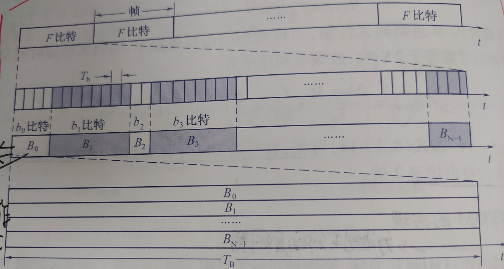
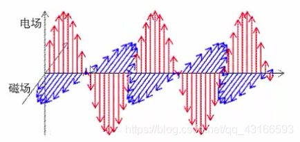
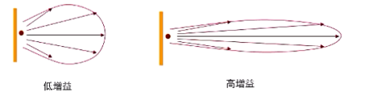

[toc]

# 相对成体系的知识
## 信号调制
### 星座图
参考：[通信里 星座图 到底是什么意思啊?](https://www.zhihu.com/question/23107539)  
解调举例：假设给定一个复数，我们分别计算它都星座图中所有点的距离，取最小距离的点，然后在一个固定的编码表中查找这个最小距离点的编号即可（这个编号就是传输的二进制信息）  

## OFDM
### OFDM详解
[给“小白”图示讲解OFDM的原理](https://blog.csdn.net/madongchunqiu/article/details/18614233)  

### OFDM的实现举例
物理信道上的信号都是时域的（严格来说这个说法应该不对，信号就是信号，只是人为增加了时域频域的视角），发射端需要将信号调制成时域的OFDM信号，经过无线信道传播，接收端再解调。由于时域`OFDM信号的表示形式就和逆傅里叶变换的结果是一样的`，所以通常使用`逆傅里叶变换（IFFT）调制信号`，使用`傅里叶变换（FFT）解调信号`。下面以`MQAM（多进制正交幅度调制）为例`举例讲解：  
  
**0x00**  
设OFDM系统的输入信号为串行的二进制码元（一个码元/波形携带一个比特），其码元持续时间（即一个完整波形对应的时长）为$T_b$，整个过程大概如下文……概括起来就是`每帧数据都通过N个子载波并行地传送`  
**0x01**  
先将此输入码元序列分成帧，每帧中含有F个码元，即有F个比特（如0x00所述，此时是二进制码元）；  
**0x02**  
然后将此F比特分成N组，`每组中的比特数可以不同`，设第$i$组中的比特数为$b_i$，则有$F=\sum_{i=0}^{N-1}b_i$；  
**0x03**  
<font color=red>将每组中的$b_i$个比特看作是一个$M_i$进制的码元$B_i$，其中$b_i=log_2M_i$</font>，`也就是说不管这组数据有多少比特，都把他们整体看作一个新的码元`

**0x04**  
<font color=red>进行串并转换，将原始的F个串行码元（每个码元bi对应一个比特）转换成N个并行的新码元（每个码元Bi对应一或多个比特）</font>。注意，由于码元对应一个波形，我们的N个新码元就对应N种波形 => 所以虽然$B_i$的比特数不相同，但是他们的持续时间（即码元/波形持续时间）应该是相同的，这里统一设为$T_B=F*T_b$  

**0x05**  
`N路并行的码元$B_i$用来对N个子载波进行不同的MQAM调制`。注意：这是的各个码元$B_i$可能属于不用的$M_i$进制，所以他们各自进行不同的MQAM调制！  

**0x06**  
……更多内容，详见《通信原理-第七版-樊昌信》 P247  


### 如何理解OFDM与傅里叶变换的关系（TODO）


## FFT
### FFT变换后的物理意义
下面说的都是离散傅里叶变换。内容主要参考自：[fft变换之后的实际意义](https://blog.csdn.net/nebula1008/article/details/121043836)、
[快速傅里叶变换(FFT)后的点的物理含义](https://blog.csdn.net/ssw09141324/article/details/78910939)  
**基础**  
```
1.信号频率：F
2.采用频率：Fs
3.采用频率必须是信号频率的2倍及以上，才能保证采到的信号没有失真
```
**物理含义**  
采样获取到数字信号后，就可以对其做FFT变换了。`N个采样点，经过FFT之后，可以得到N个点的FFT结果，这N个点是以复数形式存储的`。为了有利于蝶形变换运算，通常N取2的整数次方。  
`变换后每一个点就对应着一个频率点`。假设一共采N个点，那么变换之后的一组点(也是N个)的横坐标为：0，fs1/N，fs2/N，fs3/N，fs4/N······fs*（N-1）/N。也就是说，变换之后每个点的横坐标都是以采样率/采样点数（fs/N）为间隔变化的，也即频率分辨率为fs/N。`这个点的模值，就是该频率值下的振幅特性`。具体跟原始信号的幅度有什么关系呢？=> 假设原始信号的峰值为A，那么FFT的结果的每个点（除了第一个点直流分量之外）的模值就是A的N/2倍。而第一个点就是直流分量，它的模值就是直流分量（信号的直流分量就是信号的平均值）的N倍。


**补充：FFT后的N点，具有以下几个物理含义**  
1.第一个点表示0HZ，第N+1个点表示采样频率Fs(N+1个点不存在)，从第1个点到N个点，这中间被N-1个点平均分成N等份，每个点的频率依次增加。例如某点n所表示的频率为：Fn=(n-1)*Fs/N；  
2.`FFT能分辨的频率是：Fs/N`，`列如，Fs=50，采样1秒钟，进行FFT，那么FFT所识别的频率是1HZ，同样是Fs=50，采样两秒钟后进行FFT，那么FFT的分辨率就是0.5HZ`. 因此`如果要提高频率分辨力，则必须增加采样点数，也即采样时间`。`频率分辨率和采样时间是倒数关系`。  
3.`由于采样频率是数字信号频率的两倍及以上，所以我们只需要前N/2个结果即可，从FFT的特性上来看，FFT后N个点是对称的，所以也只需要查看前N/2个结果.`  


### 增加FFT点数意味着什么
对于FFT而言变换前后的点数是相同的，也就是说`时域信号的点数等于频域信号的点数`。所以，`增加FFT的点数其实就是增加用于FFT的时域信号的点数`。达成此目的一般有三种途径：  
```
1.采样率不变，增加采样的时长；
2.采样时长不变，提高采样率；
3.在时域信号后面补0（这里不考虑给时域信号插值这样的骚操作）。
```
以上能增加频域分辨力的途径只有第一种。`第二种途径实际上扩大了频谱的范围（提高了频域的上限）但并没有增加频域的分辨力（FFT后相邻两个点之间的频率差不变）`。第三种途径仅仅是对频域进行插值处理，同样没有提高频域的分辨力。(具体理论分析参见FFT的公式和各个量的物理意义，在此略过)  

同样，关于利用增加点数带来的FFT Processing Gain提高弱信号识别能力这一点，也是仅仅在第一种途径下才成立的。从另一个角度理解，`频域的信息是由时域累积的信息构成的，因此对于一个平稳的信号，提高对信号的观测时间长度即增加了时域累积的信息，对应到频域就是信噪比的提升`。因此“更大的fft size有利于识别微弱的信号”这句话在一定的前提下是正确的。当然这种改善不是无限的，实际情况下会有各种问题，除了蒋宇辰大佬提到的ADC非线性外，系统中还有很多其它的非线性或非高斯的干扰因素，这些东西（基本就是指前级的硬件）会共同决定“识别微弱信号”的下限。  
更多参考：[更大的fft size是否容易发现微弱信号？](https://www.zhihu.com/question/276261013)  


# 杂七杂八积累
## 信号的功率和能量
信号$f(t)$在t处的瞬时功率是$f(t)$的模(瞬时幅度)的平方，即：$P=|f(t)|^2$；  
信号$f(t)$的能量是瞬时功率的积分值，即：$E=\int_{-\infty}^{+\infty} |f(t)|^2 {\rm d}t$
TODO:如何理解这里功率和能量的物理意义 ?  


## 码元与比特、符号的关系
- 1.一个码元其实就是一种波形，若码元是k进制的，则共有k种波形；  
- 2.一个码元（或者说一种波形）可以认为携带了一个或多个比特的信息。比如二进制码元携带一比特信息，四进制码元携带两比特信息；  
- 3.码元与符号是相对应的，常说的符号其实也就是码元；  
举例子：  
```
二进制码元含有一个比特信息  => 码元是二进制的，即有两种波形，一种波形代表0，一种波形代表1，所以一个码元只能携带一比特信息（0或者1）
四进制码元含有两个比特信息  => 码元是四进制的，即有四种波形，分别代表00、01、10、11，所以一个码元能写到两比特信息（00或者01或者10或者11）
八进制码元含有三个比特信息  => ......
```
总结：`进制越高，单个码元传递的信息（比特数）越多`  


## 频偏
单位：ppm => 每百万单位（parts per million)；  
在用作表示频率偏差时，它表示`在一个特定中心频率下，允许偏差的值`，频率以赫兹为单位。ppm和赫兹之间的换算关系如下式：`△f=(f*ppm)/10^6`；  
这里 ppm 是最大变化值（+/-），f是中心频率（赫兹），△f是允许最大的频率变化范围；  
例如：如果100MHz的频率允许的100 ppm的频率误差。利用上面公式得出频率的变化是10kHz。那么系统的最大频率是100.01MHz，最小是99.99 MHz。  

## 相位的物理意义(待完善)
$x=Asin(wt+φ)$  
$wt+φ$是相位，它其实描述了：`处于一个周期中的什么阶段`，这就是相位；  


## 频率和相位的关系
$x=Asin(wt+φ)$  
`注意$wt+φ$才是相位，$φ$只是初相`;  
总结：  
```
1.由公式可知:相位p=频率f对时间的积分;  
2.在数学上相位偏差是频率偏差的累积;
```
关于第二点:`在数学上相位偏差是频率偏差的累积`，可参考：[科普：频率和相位的关系](https://blog.csdn.net/baowxz/article/details/111180209)  


## 无线电的传播以及无线电波的极化
电磁波传递过程中，电场和磁场在空间是相互垂直的，同时这两者又都垂直于传播方向，如图：  
  
天线向周围空间辐射电磁波，其电场方向是按一定的规律而变化的。天线的`极化，就是指天线辐射时形成的电场强度方向`：  
```
1）如果电波的电场方向垂直于地面，我们就称它为垂直极化波。
2）如果电波的电场方向平行于地面，我们就称它为水平极化波。
```

## MIMO(待完善)
多进多出（MIMO）是为极大地提高信道容量，`在发送端和接收端都使用多根天线`，在收发之间构成多个信道的天线系统。MIMO系统的一个明显特点就是具有极高的频谱利用效率，在对现有频谱资源充分利用的基础上通过利用空间资源来获取可靠性与有效性两方面增益，其代价是增加了发送端与接收端的处理复杂度。大规模MIMO技术采用大量天线来服务数量相对较少的用户，可以有效提高频谱效率。  

## wlan天线相关知识(重要)
参考：[WLAN—天线技术原理&各种器件介绍](https://blog.csdn.net/qq_43166593/article/details/84973270)  

## wlan的各种天线布局结构及其特点(todo)

## 功分器/耦合器/合路器
**功分器**：将一路输入信号能量`等分`成两路或者多路输出的器件；  
**耦合器**：将一路输入信号能量`不等分`成两路输出器件；  
**合路器**：用来将多个系统的发射信号互不干扰地组合成为一路输出，同时在同一路中的接收信号互不干扰地分配给各个系统端口，可分为同频合路器和多频合路器；  


## 天线增益
**增益**（覆盖距离的关键指标）：相同输入功率时时，天线在某一规定方向上的辐射功率密度与参考天线（通常采用理想辐射点源）辐射功率密度的比值；  
增益与天线方向图密切相关，方向图主瓣窄，副瓣越小，增益越高，如图：  
  


## 多径与多径结构
**多径的概念**  
载频比较大（比如大于500Mhz）的无线电信号的传播可以近似看作是光学射线的传播。无线电信号传播时，这些“射线”可以在光滑的平面（比如建筑物的墙壁、地板）上进行反射，遇到锐利的边缘会发生衍射，遇到小型的物体（比如树叶）会发生散射。发射源发出的`无线电信号可以通过多条路径传播到同一位置`，因此在一个位置上会接收到多条射线，`每条射线有不同的能量强度和时延`。时延取决于射线传播的距离，强度取决于距离和具体的传播情况（反射、衍射等）。每条到达接收器的射线称为一个多径分量。  

**多径结构与指纹定位**  
信道的多径结构指的是这一组（多条射线）信号强度和时延。多径结构也称作功率时延分布，下图是一个典型的功率时延分布的例子，其中，有6个有效的多径分量，功率和时延分别为β1，β2，β3，β4，β5，β6和τ1，τ2，τ3，τ4，τ5，τ6。
  
如果信号的带宽足够大（比如使用直接序列扩频技术或者超宽带技术），那么在接收器上可以分解和处理各个多径分量。某个位置上得到的多径结构取决于实际的环境，是独特的，能够被用来作为位置指纹。Ahonen and Eskelinen (2003）提出了这种方法定位3G UMTS网络中的手机，他们的研究结果指出，使用这样的多径结构作为位置指纹可以达到67%的情况下25m以内的定位精度，以及95%的情况下188m的定位精度，这样的定位性能满足了FCC的关于手机定位的E-911要求。  

## 晶振
晶振是石英晶体振荡器的简称，其作用是与集成电路或三极管一起构成频率十分稳定的振荡器。  
晶振在电路中的作用是为系统提供基本的时钟信号。通常一个系统共用一个晶振，便于各部分保持同步。有些通讯系统的基频和射频使用不同的晶振，而通过电子调整频率的方法保持同步。  


