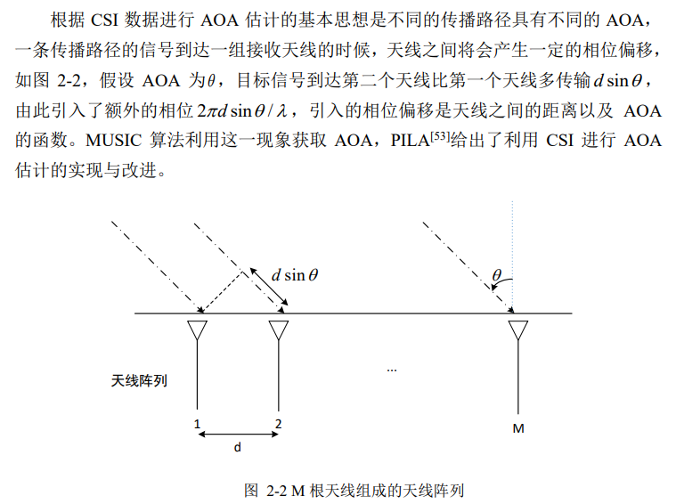

[toc]
# 毕设实验设计
## 一些注意事项
- 考虑天线方向(以及设计实验时如何考虑其他诸多影响因素呢？)  
- 验证一下采集到的数据的分布  
- 根据前人说法：在不同场景下 LDA-Bayes 算法定位的准确度均高于 PCA-Bayes 算法  
- 一个好的采样方法应该仔细选择采样点所在位置和间隔：即不会太稀疏，这会降低定位精度，也不会太稠密，这就需要大量的数据收集工作 
- 原始的样本具有很多噪声，需要对原始样本进行特征指纹选择和数据预处理之后，再进行模型训练。
- 在动态的环境中，相位变化很大
- 环境中有多个AP（但是只想使用其中一个AP）会造成影响吗？
- 


## 待尝试的方向
- 尝试引入attention机制来进行加权(WKNN、WPCA等)，与传统方法对比一下  
- 目前看到的毕业论文基本都是指纹定位看作分类问题 => 是否可以尝试看作回归问题，用深度学习来做回归预测，并与传统方法对比一下？  
- CSI的幅度、相位(进行一定预处理后)分别用于定位； 以及结合起来定位(相位的作用真的大吗?)  
- 实际环境中，指纹库需要实时更新，是否可以建立一个可动态更新的系统  
- 基于CSI的多种方法融合定位  
- 


## 想法
- 做一个室内(机房内)被动定位的系统 => 琐碎的事情比较多，精度没有保证，但是很有意义
- 做动态的定位 还是 静态的定位  
- 如果做目标跟踪是否在能力范围内?  
- 实验场地的选取，直接在机房是否可行(夜晚无人时测量数据)？  
- 


## 备忘
- 关于实验场景的设计，矿业大学-2019写得比较详细，可以参考参考
- 


# 论文结构/内容构思
## 章节分配
- 实验数据的基本分析与预处理可以写一章节

## 综述部分
**xxxxxxxxxxxxxxxxxxxxxxxxxxxxxxxxxx 矿大 2019综述 xxxxxxxxxxxxxxxxxxxxxxxxxxxxxxxxxxxxxxxxxxxxxxxxx**
- 2000年，Paramvir Bahl 提出 RADAR 系统[43][44]，它是世界上第一个基于 RSS 的定位算法系统
- 2004 年，Youssef 研究员在以改进的 RADAR 系统的基础上提出了 Horus[47]定位系统，它们在离线阶段对比分析了空间中 RSS 的概率分布，并使用聚类算法分类指纹库中的指纹，降低了定位系统的复杂度
- Sen 研究员在 2012 年首先提出了第一个基于 CSI 的室内定位系统，并将系统命名为 PinLoc
- 2013，Jiang Xiao 研究员提出了一个 Pilot 系统[60]，他在 PinLoc 定位系统的基础上，首先利用 CSI 的频率特性实现了对目标区域的监控功能，并实现了对目标区域的人体的定位
- 2012 年，Kaishun Wu 研究员提出了名为 FILA 的定位系统
- JiangXiao 研究员提出一个名为 FIFS[63]的 CSI 定位系统，他利用 CSI 在频率以及空间上的差异性，采集 4 个子载波的功率数据作为指纹信息建立指纹库，并通过贝叶斯模型进行定位，定位的结果在 FILA 的基础上进一步得到了提升
- ——以上基于 CSI 的都是将采集到的子载波的功率数据作为指纹———
- Xuyu Wang 分别提出了 PhaseFi[65]和DeepFi[66]室内定位系统，系统定位分为离线阶段和定位阶段，在离线阶段，分别`采集 CSI 的振幅数据和相位数据`，结合机器学习中的经典算法受限玻尔兹曼机（Restricted Boltzmann Machine, RBM）[67]训练数据建立指纹库，最后通过贝叶斯模型进行定位
- Rui Zhou在文献[68]中采用支持向量机（Support Vector Machine,SVM）[69]算法进行定位，首先利用主成分分析方法压缩采集的 CSI 数据维度，再利用改进的 SVM 算法进行回归分析进行定位
**xxxxxxxxxxxxxxxxxxxxxxxxxxxxxxxxxx 矿大 2019综述 xxxxxxxxxxxxxxxxxxxxxxxxxxxxxxxxxxxxxxxxxxxxxxxxx**

## 数据分析与预处理
- 对比RSS与CSI对环境敏感度的差异，说明CSI的优越性
- 验证CSI频率的多样性、空间多样性
- 


# CSI
## CSI的意义
每组CSI代表一组正交频分复用(OFDM)子载波的幅度和相位。  
## 如何获取wifi CSI
```
Halperin D, Hu W, Sheth A, et al. Tool release: gathering 802.11n traces with channel state information. Acm Sigcomm Computer Communication Review, 2011, 41(1):53.
```
......  
可以通过修改设备驱动[57]的方法在普通的商用 WiFi 设备上获得CFR/CIR，利用 Intel 5300 NIC 可以获取一组 CFR 采样即 CSI  

## CSI相关的计算公式
**CSI的数学含义**  
时域的CIR可表示为： 
$$h(t)=\sum_{i=0}^N\alpha_i e^{-j\theta_i}\delta(t-t_i)$$
其中，$\alpha_i$、$\theta_i$、$t_i$分别表示第$i$条路径的幅度衰减、相位偏移和时间延迟；  
频域的CFR与CIR互为傅里叶变换；  

**CSI、发送信号、接收信号的关系**  
时域内接收信号$r(t)$可以表示为发送信号$s(t)$和信号冲击响应$h(t)$(即CIR)的卷积：  
$$r(t)=s(t) \otimes h(t)$$  

## 基于传播模型(距离衰减)的CSI定位
CSI 信号测量的是从发送端基带信号到接收端基带信号的信道矩阵，RSSI 信道是在接收端的射频段（2.4GHz）测量得到的，因此，`RSSI 的自由空间衰减模型无法直接应用于 CSI`  
这部分可参考其他硕博论文中的总结，非毕业重点，暂略  

## 基于AOA的CSI定位
AOA的基本原理如图：  

理论上，通过CSI测量值可得到一组相位差$△\varphi$(理解`相位的物理意义：它描述了所处的阶段`!!)，结合已知的天线间距$d$等信息，可直接计算出到达角$\theta$...... 更多内容可参考其他资料  

## 基于位置指纹的CSI定位
位置指纹算法相对简单且易于实现，且对多径传输变化相对不敏感，因此受到了更为广泛的关注.  

算法一般分为两个阶段：线下阶段和线上阶段。`线下阶段`的主要工作包括数据收集、数据预处理、特征提取、特征存储四个步骤；`线上阶段`主要是将待定位数据与已有的特征数据进行比对，选择最为相似或者最可能的特征数据的位置作为待测点的位置。  

数据比对一般分为两种思路：KNN 算法以及贝叶斯算法.  


# 杂七杂八
## 接收信号强度：RSS与RSSI
参考：[信号强度（RSSI）知识整理](https://www.cnblogs.com/zhangsenzhen/p/9449396.html)  
**RSS:received signal strength**：翻译过来就是表示接收信号强度，是`真实的信号强度`。$ R=10logP $ ， 其中$P$就是发射端的发射功率(也就是幅度的平方)，R就是表示接收端接收到的信号强度， `一般是负值`。只用在最理想的情况下，R取值为0。所谓理想情况下，就是发射端的发射功率，传输到接收端，接收到的功率仍是一样的，则认为是理想情况。但是在实际情况下，理想环境是不存在。故，得到的RSS一般都是用负数表示。-50dbm--0dbm之间表示信号很好，能够满足我们的基本使用；  

**RSSI:received signal strength indicator**：翻译过来就是接受信号强度指示，`通过人为处理，而得到的信号强度`。一般RSS负数不太好理解，可以通过变换转化为正值（RSSI，没有单位）。  


## RSSI定位的几种主要方式
RSSI 室内定位技术主要分为三类：位置指纹算法、传播模型算法、RSSI/传感器融合算法
**位置指纹算法的主要思想**  
……略

**传播模型算法的核心思想**  
建立距离与 RSSI 之间的函数关系，通过[三边定位算法](http://www.elecfans.com/tongxin/rf/20130108304360_2.html)获得待测点的位置，同样可以分为离线和在线两个阶段，离线阶段主要进行数据收集与模型训练，将待测点的RSSI作为输入数据计算与参考点之间的距离，从而获得待测点的位置。传播模型算法的主要问题在于室内环境复杂多变且受到多径等因素的影响，使得传播模型中的衰减因子不断变动。  

**RSSI/传感器融合算法的主要思想**  
利用手持智能设备中的传感器进行运动状态、运动距离、运动速度等的监测，结合位置指纹算法实现室内定位导航，降低离线阶段所需的人力、时间投入，这一算法的主要问题在于普通的商用设备的传感器精度不高，且存在着累积误差，无法实现长时间的正确定位导航。  


## CSI/CIR/CFR(待完善)
参考：[CSI简析（一）](https://blog.csdn.net/sundreamoon/article/details/79524045)  
[信道冲击响应CIR和信道状态信息CSI的关系是什么？](https://www.zhihu.com/question/302517138)  

**CSI(信道状态信息)**：就是通信链路的信道属性。它描述了信号在每条传输路径上的衰弱因子，即信道增益矩阵H（有时也称为信道矩阵，信道衰落矩阵）中每个元素的值，如信号散射（Scattering）,环境衰弱（fading，multipath fading or shadowing fading）,距离衰减（power decay of distance）等信息。CSI可以使通信系统适应当前的信道条件，在多天线系统中为高可靠性高速率的通信提供了保障。  
**CIR(信道冲击响应)**：用于描述无线信道的多径效应 => 这个应该是时域的；  
**CFR(信道频率响应)**：信号的多径传播在时域上表现为时延扩展(如何理解？)，而在频域会造成信号的选择性衰落，因此，也可以用无线信道的频率响应（Channel Frequency Response，CFR）从幅频特性和相频特性来分别描述信号的多径传播。在带宽无限的条件下，`CFR与CIR互为傅里叶变换`。  
**关系总结**  
`CSI可以通过CFR与CIR描述，CFR与CIR为傅里叶变换关系`  
**计算公式**  
CIR/CFR需要通过信道估计获得，具体方法可参考相关文章；  
不过时域的CIR可表示为： 
$$h(t)=\sum_{i=0}^N\alpha_i e^{-j\theta_i}\delta(t-t_i)$$
其中，$\alpha_i$、$\theta_i$、$t_i$分别表示第$i$条路径的幅度衰减、相位偏移和时间延迟，
频域的CFR与CIR互为傅里叶变换  


## AOA&TOA
参考：[无线定位原理：TOA & AOA](https://blog.csdn.net/qq_23947237/article/details/82738191)  

## UWB
UWB(Ultra Wideband)：超宽带是一种无线载波通信技术，它`不采用正弦载波，而是利用纳秒级的非正弦波窄脉冲传输数据，因此其所占的频谱范围很宽`。UWB技术具有系统复杂度低，发射信号功率谱密度低，对信道衰落不敏感，截获能力低，定位精度高等优点，尤其适用于室内等密集多径场所的高速无线接入.


## 信道估计
$Y=HX+N$  
公式中X是发送信号，Y是接收信号，N是噪声；  
信道矩阵H完全描述了信道的特性，计算信道矩阵的过程称为信道估计。应用OFDM和MIMO技术的无线接收机需要对信道进行估计，`信道估计的精度将直接影响定位系统的性能`；  

## 定位方式：远程定位/自身定位
如果待定位设备是在发送信号，由一些固定的接收设备感知待定位设备的信号或信息然后给它定位，这种方式常常叫做**远程定位**或者网络定位；  
如果是待定位设备接收一些固定的发送设备的信号或信息，然后根据这些检测到的特征来估计自身的位置，这种方式可称为**自身定位**；  

## 位置指纹
主要参考：[室内定位系列（一）——WiFi位置指纹（译）](https://www.cnblogs.com/rubbninja/p/6120964.html)  
WiFi信号并不是为定位而设计的，通常是单天线、带宽小，室内复杂的信号传播环境使得传统的基于到达时间/到达时间差（TOA/TDOA）的测距方法难以实现，基于到达信号角度的方法也同样难以实现 => `传统的基于时间和角度的定位方法并不适用于WiFi`；  

**指纹的概念**  
个人理解：位置指纹就是某个位置处信号的特征，也就是说，`指纹即特征`。  

**指纹(特征)的组成**  
位置指纹可以是多种类型的，任何“位置独特”的（对区分位置有帮助的）特征都能被用来做为一个位置指纹。比如某个位置上通信信号的多径结构、某个位置上是否能检测到接入点或基站、某个位置上检测到的来自基站信号的RSS（接收信号强度）、某个位置上通信时信号的往返时间或延迟，这些都能作为一个位置指纹，或者也可以将其组合起来作为位置指纹。有两种最常用的信号特征：`多径结构`、`RSS`；  

**指纹定位过程、算法、性能**  
参考上述链接即可...  


## NLOS(todo)
**non—line of sigh**：  

## 三边定位算法
参考:[三边定位算法](http://www.elecfans.com/tongxin/rf/20130108304360_2.html)  

## 无设备的室内定位(todo)
室内定位技术可分为两类:主动（需要被定位者持有智能设备）和被动(无需被定位者持有智能设备，又叫无设备室内定位)  

有设备的定位可以在智能设备连接上 WIFI 之后就认为目标存在；而无设备的系统则要求通过检测定位区域中异常实体的出现来实现类似的功能。  

## 定位性能评价指标
**定位精度**  
描述的是被定位物体的实际位置和预测位置之间的距离，距离越小，说明定位精度越高；  
=> 举例：若将室内可定位区域划分为K个正方形单元，则对于定位精度而言，最高的定位精度即是正方形单元的边长!!

**定位准确度**  
是一个概率值，它指的是在一定精度范围内能够准确定位的概率；一般和定位精度结合对定位系统进行评估。  
=> 举例：定位准确度则指的是将采样正确定位到其所属单元的概率。  

**定位误差**  
定位误差则按照其实际所属单元中心和预测单元中心之间的距离计算  
