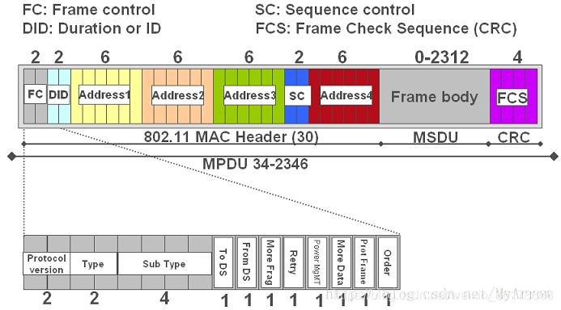

[toc]
# wifi/802.11相关知识
## 概述
**快速入门的博客**  
[IEEE 802.11协议基础知识整理](https://www.cnblogs.com/wpf-blogs/p/13688470.html)  

**概述**  
IEEE802.11主要分为两层，物理层（PHY）和媒介访问控制层（MAC）  
`MAC层`：主要负责信道访问控制、帧的分割重组、纠错、多速率管理等  
`PHY层`：直接与无线信道交互的层次，为MAC层提供无线传输的物理层服务访问点（怎么说人话？）

## 频谱划分
下面以为2.4G频段为例子：  
  
- IEEE 802.11b/g标准工作在2.4G频段，频率范围为2.400—2.4835GHz，共83.5M带宽
- 划分为14个子信道
- 每个子信道宽度为22MHz
- 相邻信道的中心频点间隔5MHz
- 相邻的多个信道存在频率重叠(如1信道与2、3、4、5信道有频率重叠)
- 整个频段内只有3个（1、6、11）互不干扰信道


## 802.11协议桢的格式（重要）
**0.分层**  
802.11数据链路层又分为两层：LLC与MAC；物理层也分为两层：PLCP与PMD。具体分层及每层数据包示意图如下：  

其中MSDU就是网络层传递下来的待发送数据；PPDU就是物理信道上真正传输的数据。


**1.MAC层帧格式(MPDU)**  
MAC帧的总体格式如图，它主要由九个部分组成，不同类型的帧在某些特定字段/部分有所区别（比如根据帧控制字段的不同内容，可分为`控制帧、管理帧、数据帧`三大类）：  

注意：`此图是MAC层帧的格式，也就是MPDU`，这里边其实还包含了LLC对应的MSDU，详细格式如图所示；  


`当MPDU传递到物理层的PLCP层时，它又被称作PSDU（其实和MPDU是一个东西），PSDU被封装成为PPDU后才是信道上真正传输的数据`。  

**2.物理层帧格式(PPDU)**  
802.11标准-2007里给出了5种PHY，也就是5种编码与调制方法，每种PHY对应的PHY帧格式都是不同的。也就是说，`虽然这个wifi标准对外的接口（MAC）是一样的，但是根据底层采用的不同PHY，底层的从帧格式到编码、调制都是不一样的`。5种PHY分别是：直序扩频（DSSS）、跳频扩频（FHSS）、正交频分复用（OFDM）、高速率直序扩频（HR/DSSS）、红外（TR）。另外，还给出一个叫ERP的增强版本的PHY，改变了调制方法，增强了 DSSS和OFDM的速率。 2009里又多了一种：高吞吐（HT OFDM），就是在原来的OFDM基础上改进得来。最新的802.11ac里又多了一种：超高吞吐（VHT OFDM），还是改进OFDM得来。两个改进的OFDM都支持MIMO，就是多天线。  
`以OFDM的PHY为例，PPDU帧格式如图`（下面部分）：  
  
`PPDU主要由三部分组成：前导码、Signal、Data`  
更详细PPDU的介绍可参考：[PPDU（PLCP子层协议数据单元）](https://blog.csdn.net/sinat_22991367/article/details/73005140)

## 前导码格式—以OFDM PLCP Preamble为例
根据“802.11协议桢的格式”所述，PHY层帧由三个部分组成：Preamble、Signal、Data，本节主要介绍前导码。  
不同的具体协议前导码有所区别，大体上有三类前导码；`Long PLCP Preamble`、`Short PLCP Preamble`、 `OFDM PLCP Preamble`，这里主要介绍第三种（`gr-ieee802-11实现的a/g/p都是OFDM PLCP Preamble`），另外两种可参考：[802.11协议笔记（二）](https://blog.csdn.net/lee244868149/article/details/53239719)  
**OFDM PLCP Preamble**格式如下：  
  
- 它也称作 OFDM 训练结构，由10个 short symbols 和2个 long symbols 组成；  
- t1-t10 叫做 `short training symbols`， GI2 叫做 long guard interval，T1和T2是两个 `long training symbols`，接下来的是SIGNAL feld 和 DATA felds，每个域都带一个GI（守卫间隔）；  
- 前导码的总长度是16us，短OFDM训练字符由12个子载波组成，长OFDM训练字符由53个子载波组成；  
`注意`：图中时间间隔的由来若看不明白，可参考下一小节“802.11a OFDM symbol”  
    ```
    t1~t10间隔时长都是0.8us，这就是 OFDM symbol 中循环前缀的持续时间；
    3.2us就是一个完整的wifi OFDM符号的持续时间(共包含了64个子载波)；
    ```

## 802.11a OFDM symbol（TODO）
参考自：[802.11a OFDM symbol](https://blog.csdn.net/rs_network/article/details/49162455)  
  
`疑问`：为何使用1/20Mhz 作发送样本的间隔？  


# SDR/USRP/gr-80211相关
## UHD_USRP_SOURCE中相关参数含义(采样率、中心频率、带宽等)(todo)
**采样率**  
UHD:USRP Source这个block中，采样率的含义是：每秒钟有多少个复数(complex)。一个复数其实就是一次采样。  

**中心频率**  
要采集的信号的中心频率  

**带宽**  


**增益**  


## gr-ieee802-11解调wifi过程详解（非常重要）
### 概述
注意：下述gr-ieee802-11解调的过程主要来自论文：An IEEE 802.11a/g/p OFDM Receiver for GNU Radio。只是文章发表较早，部分内容已经与目前的库稍微有点区别（不过区别也不大）。  

此图主要可视为两个阶段：`Wifi Sync Short` 之前属于 frame detection 阶段，这个阶段通过相关找到帧的位置；`Wifi Sync Short`及之后属于 frame decoding 阶段，这个阶段进行解码提取相应的数据……  

**1.图中各block的功能**  
**delay**：让整个数据流延迟n个采样点。它是在整个数据流最开始时添加n个0采样，后面的数据依次传送即可。  

### 1.Frame Detection(已理解，待完成笔记,TODO)
- `UHD_USRP_SOURCE 这个block接收到/并输出的信号都是时域的值`
- Each IEEE 802.11a/g/p frame starts with a short preamble sequence, which consists of a pattern that spans 16 samples and repeats ten times
- 

### 2.Frequency Offset Correction(没懂，TODO)
- Frequency offset correction is required, as the local oscillators(振荡器) of sender and receiver might work on slightly different frequencies  
- Currently, we use only the short training sequence for estimating the frequency offset between sender and receiver  
- 

### 3.Symbol Alignment
- Each OFDM symbol spans 80 samples, consisting of 16 samples of cyclic prefix and 64 data samples  
- The task of symbol alignment is to calculate where the symbol starts, to extract the data symbols, and to feed them to an algorithm doing a Fast Fourier Transformation (FFT)  
- This alignment is done with the help of the long training sequence, which is composed of a 64 sample long pattern that repeats 2.5 times(前导码中的长训练序列，GI2、T1、T2共2.5倍64个采样点)  


### 4.Phase Offset Correction
- the OFDM Equalize Symbols block is the first one in frequency domain and is responsible for phase offset correction and channel estimation
- As the sampling times of sender and receiver are not synchronized and as the symbol alignment is not perfect, a phase offset is introduced  
- This phase offset is linear with frequency and can be corrected with the help of pilot subcarriers(通过导频子载波进行相位偏移纠正)
- IEEE 802.11 mandates four pilot subcarriers that encode a predefined BPSK constellation which is the same for each frame, but changes from symbol to symbol. Thus, the symbol index within the frame has to be known => it is signaled by a tag in the sample stream that is added by the OFDM Sync Long block
- Based on the four pilots the phase offset is estimated by a linear regression and compensated.


### 5.Channel Estimation
- the OFDM Equalize Symbols block is the first one in frequency domain and is responsible for phase offset correction and channel estimation
- This block(指信道估计的block) also removes DC, guard and pilot subcarriers and thus subsets the 64 symbol input vector into 48 symbols

### 6.Signal Field Decoding
- In each frame, the short and long training sequences are followed by the signal field, which is a BPSK modulated OFDM symbol encoded with a rate of 1/2 that carries information about the length and encoding of the following symbols  
- If the signal field is decoded successfully, i.e., if the rate field contains a valid value and if the parity bit is correct, OFDM Decode Signal annotates the sample stream with a tag, carrying a tuple of encoding and length of the frame. This tag is used by the following block to decode the payload.
在这个版本的gr-ieee802-11中，这个功能在 `wifi frame equalizer` 中实现


### 7.Frame Decoding

## gr-ieee802-11接收数据时如何进行的并串转换（TODO）？


# 杂七杂八积累
## WEP/WPS-PSK(todo)
## NB-IoT
NB-IOT是窄带物联网（Narrow BandInternetof Things）的简写，为了和现在的移动网络兼容，主要基于LTE技术（ 3GPP Release 13）。现在中国的三大运营商都在加紧部署NB-IOT网络。  
一个NB-IOT基站可以覆盖10km的范围，小县城一个基站就可以覆盖了。同时NB-IoT比LTE和GPRS基站提升了20dB的增益，能覆盖到地下车库、地下室、地下管道等信号难以到达的地方，在地下是不可能有信号打电话的，但NB-IOT仍然可以通信！


# TODO
## 采样带宽对计算速率的影响？
## Each OFDM symbol spans 80 samples, consisting of 16 samples of cyclic prefix and 64 data samples 如何理解？
如果降低了采样率，它还是80个samples吗，如果是，为什么还能是80个samples呢？
## 如何理解离散FFT，比如gr-ieee802-11 64的size，这个64如何理解？


